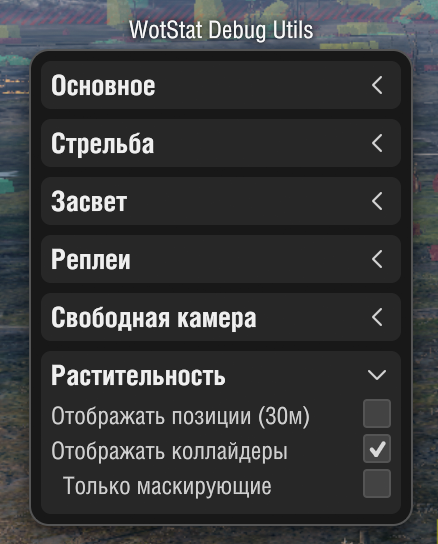

### | RU | [EN](./README_EN.md) |

# WotStat Vegetation

Мод для отображения коллайдеров растительности используемых в системе маскировки. Позволяет изучать их расположение, форму и поведение. Исследовать "дырки" в кустах и разбираться в неожиданных засветах.

> [!NOTE]
> Мод работает только в `Реплеях` и `Тренировочных боях`. В соревновательных режимах (Случайные, Клановые, Командные бои) мод не будет работать.

## Установка
1. Скачайте файл мода [`wotstat.vegetation_1.0.0.mtmod`](https://github.com/wotstat/wotstat-vegetation/releases/latest).
2. Поместите их в папку `Tanki/mods/{АКТУАЛЬНАЯ_ВЕРСИЯ_ИГРЫ}/`.

## Использование

- `F2` - Показать/Скрыть коллайдеры растительности.
- `F3` - Показать/Скрыть только маскирующие коллайдеры.

### Значение цвета коллайдера
Цвет коллайдера зависит от его маскирующих свойств:
- `Зеленый` - добавляет 50% маскировки.
- `Желтый` - добавляет 25% маскировки (обычно это деревья без листвы).
- `Красный` - коллайдер не маскирует, но при этом существует в игре (обычно это маленькие деревья или кустики, которые находятся в категории травы)

### Интеграция с wotstat-debug-utils
Мод поддерживает интеграцию с [wotstat-debug-utils](https://github.com/wotstat/wotstat-debug-utils).

Откройте меню мода (`F2`) и найдите раздел `Растительность`. Там вы сможете управлять отображением коллайдеров, а так же отобразить маркеры координат всей растительности с их названиями (в радиусе 30 метров от камеры)

## Примеры 

