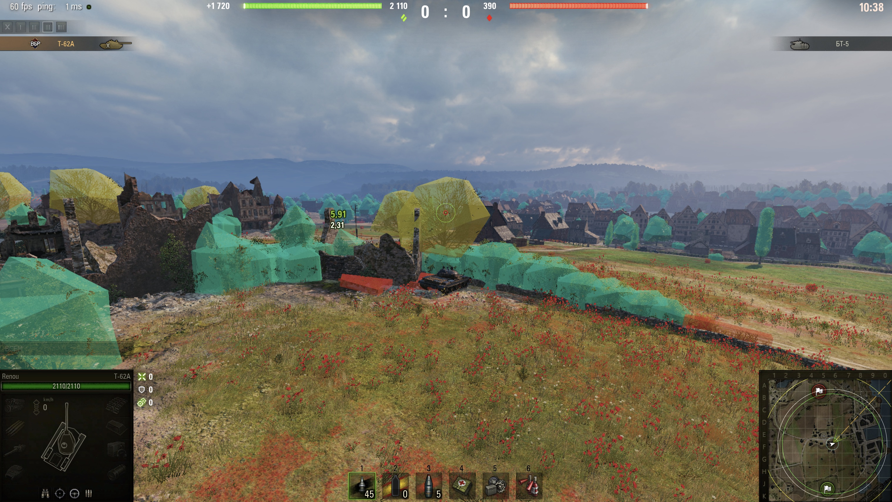
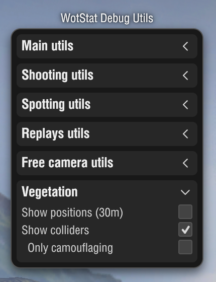
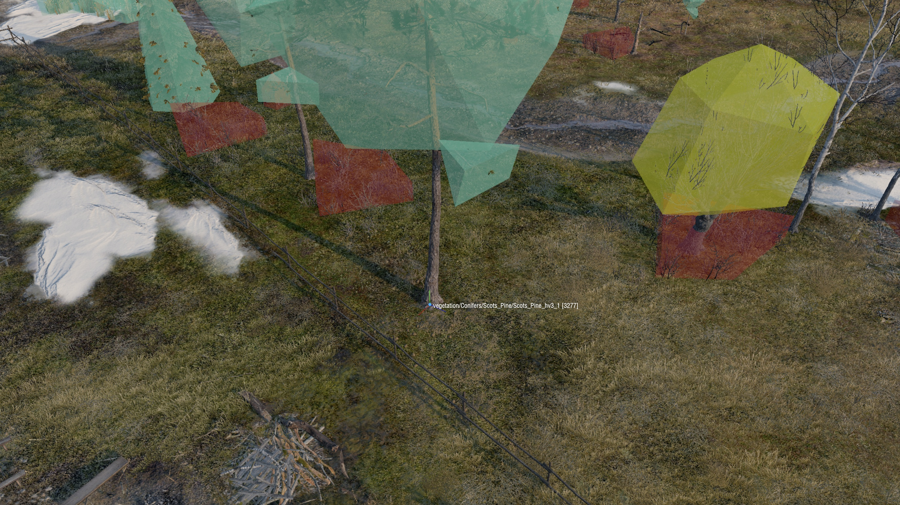
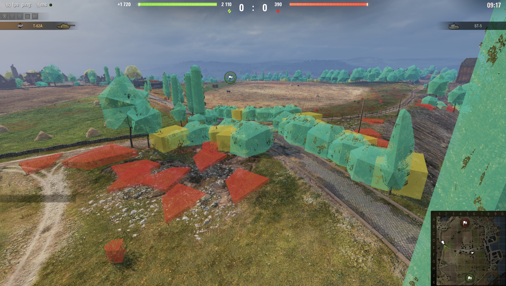
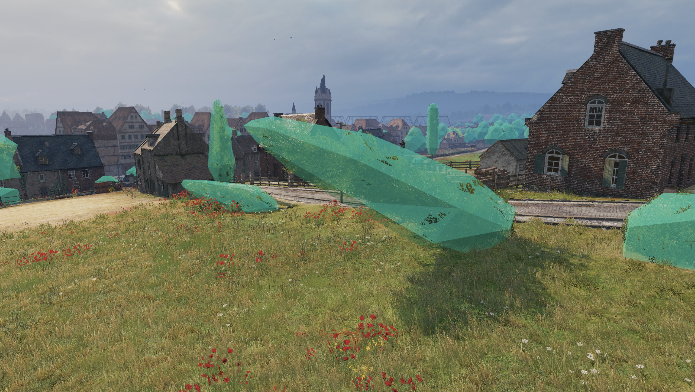
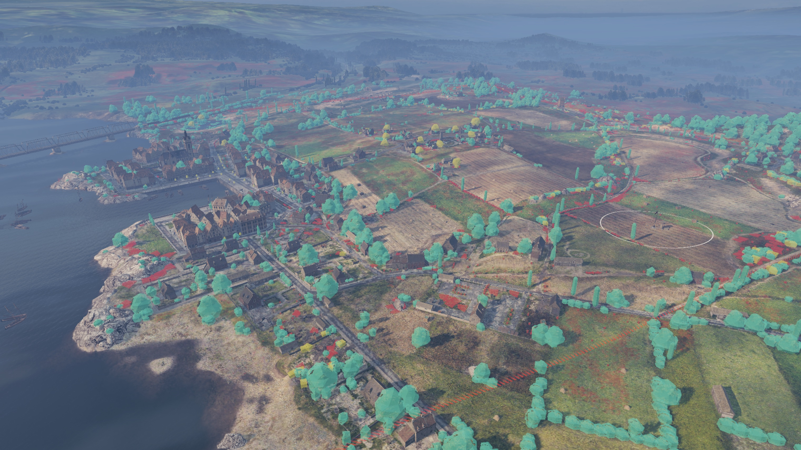
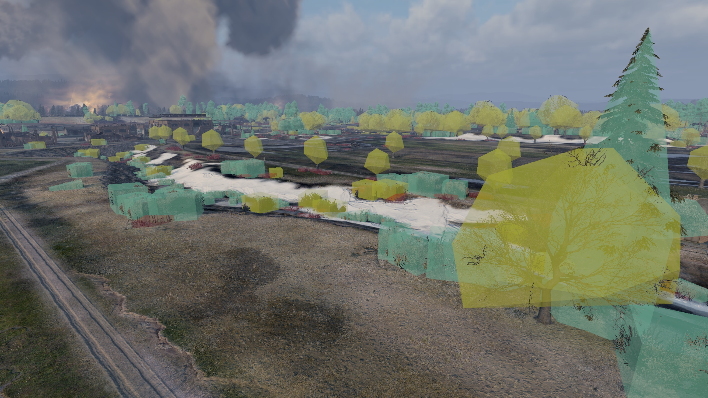

### | [RU](./README.md) | EN |

# WotStat Vegetation

A mod for displaying vegetation colliders used in the concealment system. It allows you to study their placement, shape, and behavior, investigate "holes" in bushes, and understand unexpected spotting situations.

> [!NOTE]
> The mod works only in `Replays` and `Training Battles`. In competitive modes — Random, Clan, and Team Battles — the mod will not work.

## Installation

1. Download the mod file [`wotstat.vegetation_1.0.0.wotmod`](https://github.com/wotstat/wotstat-vegetation/releases/latest).
2. Place it in the `WoT/mods/{CURRENT_GAME_VERSION}/` folder.

## Usage

* `F2` - Show/Hide vegetation colliders.
* `F3` - Show/Hide only concealment colliders.

### Collider Color Meaning

The collider color depends on its concealment properties:

* `Green` - adds 50% concealment.
* `Yellow` - adds 25% concealment; usually trees without foliage.
* `Red` - the collider does not provide concealment, but still exists in the game; usually small trees or bushes that belong to the grass category.

### Integration with wotstat-debug-utils

The mod supports integration with [wotstat-debug-utils](https://github.com/wotstat/wotstat-debug-utils).

Open the mod menu (`F2`) and find the `Vegetation` section. There you can control collider visibility, as well as display coordinate markers for all vegetation objects with their names within a 30-meter radius of the camera.

## Examples

