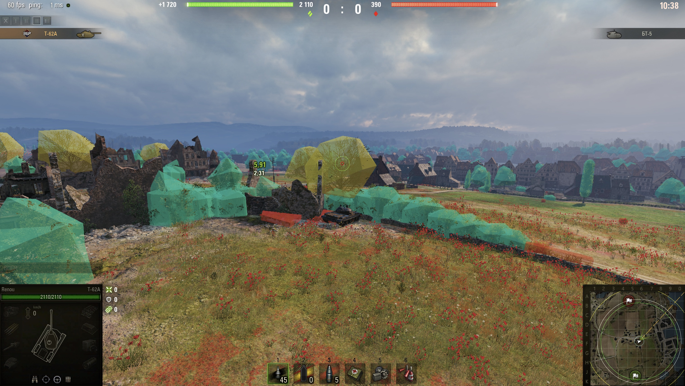
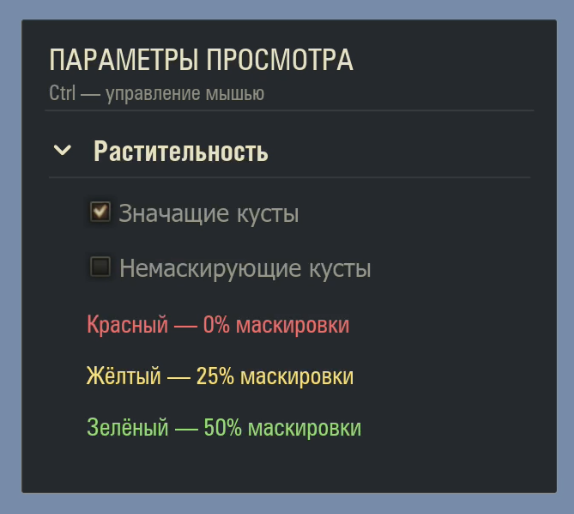
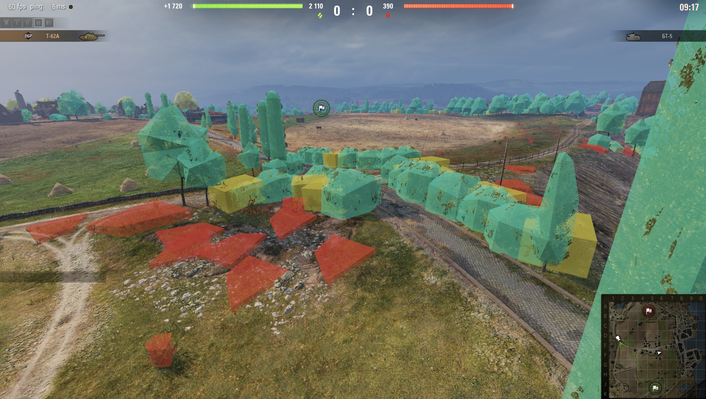
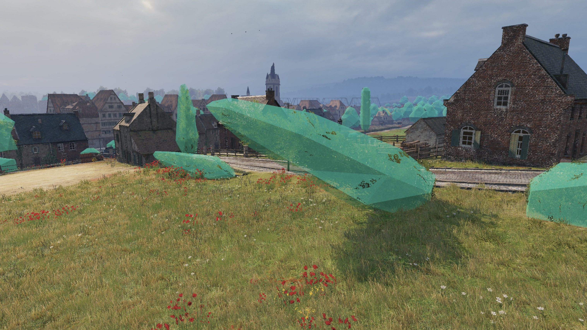
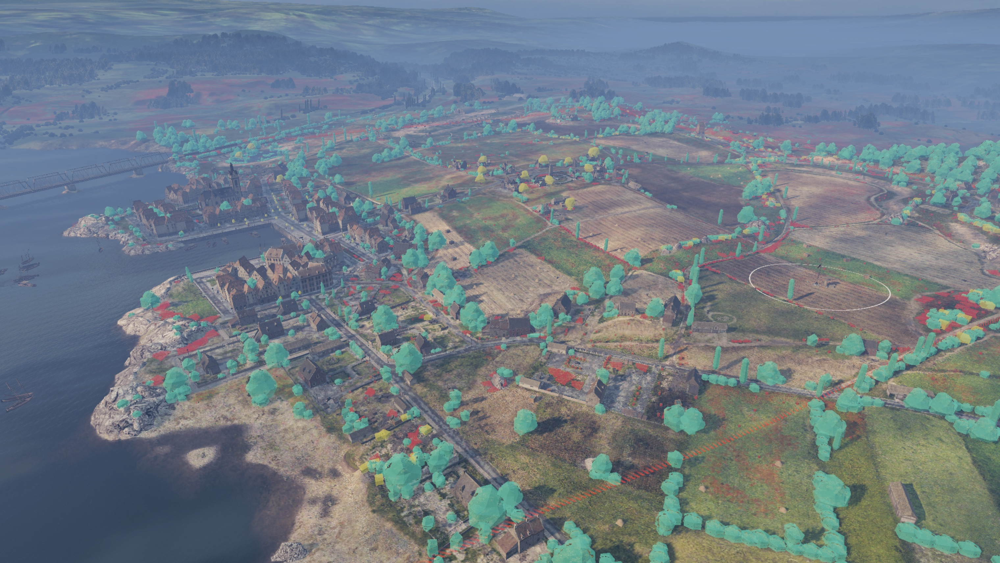
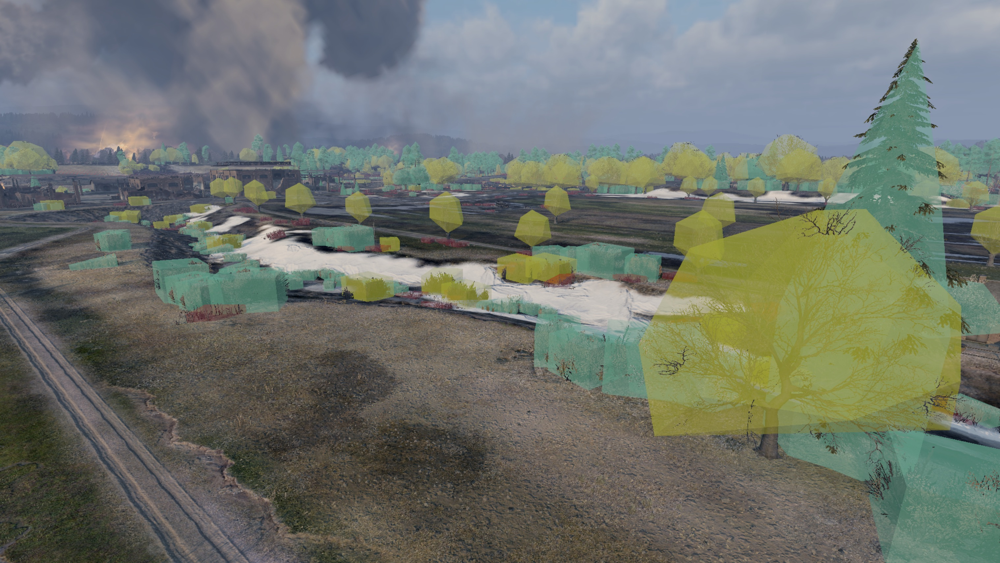

### | [RU](./README.md) | EN |

> [!IMPORTANT]
> At present, the mod is **definitely allowed on Lesta**. It is being monitored, but you will not be banned for using it.
> ---
> On WG, the mod's status is unclear and there is no definitive answer. To avoid any risk, it is best to use it only in `Replays`. There is no one to ban for watching a replay.
> ---

If anything changes, I will update this page, and the corresponding restriction will appear on the [game's list of prohibited mods](https://tanki.su/ru/content/guide/ban/nonusefulmods/). The mod does not change vegetation transparency; it adds newly generated objects that did not previously exist. Therefore, it does not fall under those rules.

# WotStat Vegetation

A mod for displaying vegetation camouflage collisions used in the spotting system. It allows you to study their placement, shape, and behavior, investigate "holes" in bushes, and understand unexpected spotting situations.

> [!NOTE]
> The mod works only in `Replays` and `Training Battles`. In competitive modes — Random, Clan, and Team Battles — the mod will not work.

## Installation

1. Download the mod file [`wotstat.vegetation_1.0.0.wotmod`](https://github.com/wotstat/wotstat-vegetation/releases/latest).
2. Place it in the `WoT/mods/{CURRENT_GAME_VERSION}/` folder.

## Usage

* `F2` - Show/Hide vegetation collisions.
* `F3` - Show/Hide only camouflage collisions.

### Collision Color Meaning

The collision color depends on its camouflage properties:

* `Green` - adds 50% camouflage.
* `Yellow` - adds 25% camouflage; usually trees without foliage.
* `Red` - the collision does not provide camouflage but exists in the game; usually grass and trees far beyond the map boundaries. The same tree can be either camouflaging or not, this parameter is determined individually for each instance.

### Local Map Viewing

The mod is compatible with [WotStat Map Viewer](https://github.com/wotstat/wotstat-map-viewer) for viewing maps locally. Simply install the mod, and its settings will appear in the viewer options.

## Examples

